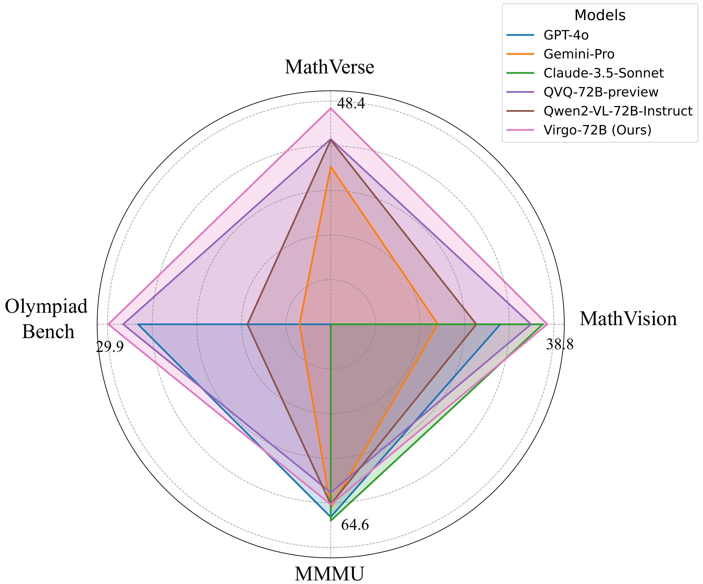
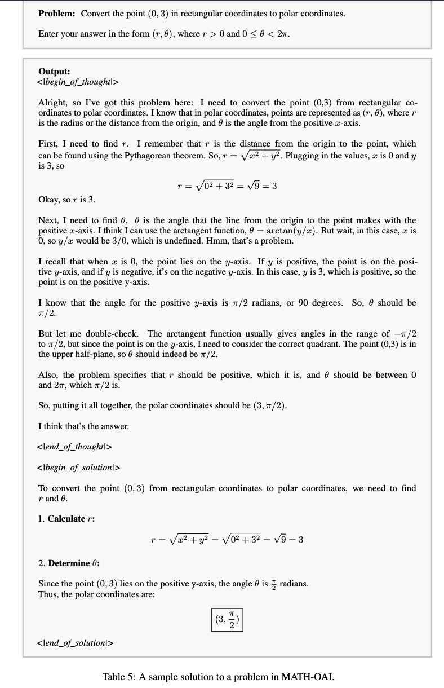
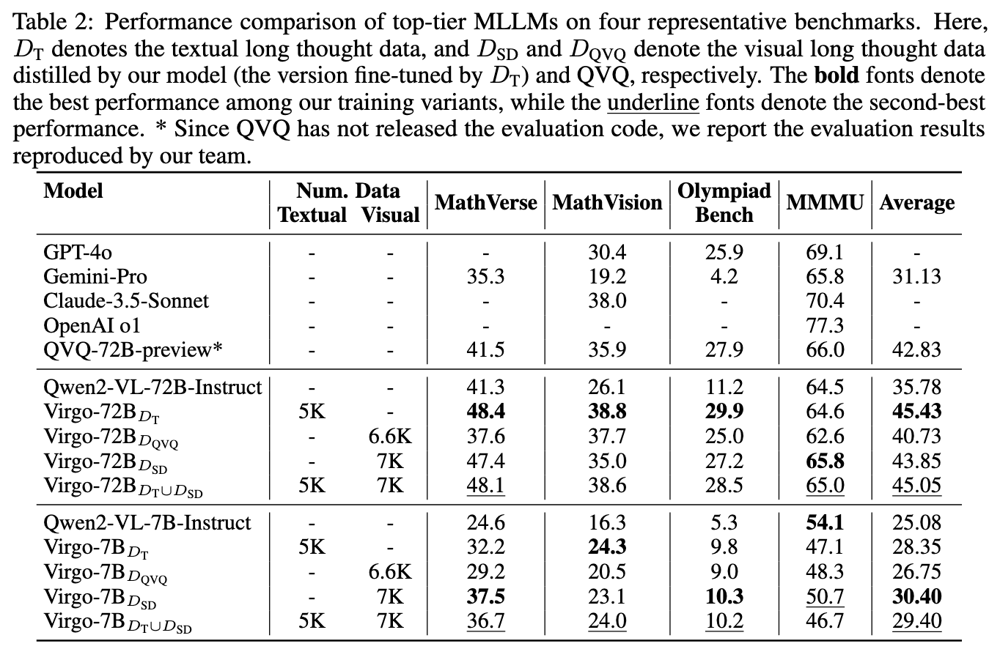

<div align=center>
<h1>Virgo: A Preliminary Exploration on Reproducing o1-like MLLM</h1>
<a href="https://arxiv.org/abs/2501.01904" target="_blank"></a>
<a href="https://huggingface.co/RUC-AIBOX/Virgo-72B"></a>
<a></a>
</div>





This project is built upon our previous work on slow-thinking with LLM:

- [Enhancing LLM Reasoning with Reward-guided Tree Search](https://arxiv.org/abs/2411.11694)

- [Imitate, Explore, and Self-Improve: A Reproduction Report on Slow-thinking Reasoning Systems](https://arxiv.org/abs/2412.09413)


## News
+ [26 Feb 2025] We release the visual long-thought data in [RUC-AIBOX/Virgo-SFT-VL-Dataset](https://huggingface.co/datasets/RUC-AIBOX/Virgo-SFT-VL-Dataset). Welcome to use our dataset!

+ [6 Jan 2025] 🎉🎉🎉 We preliminarily reproduce **a o1-like MLLM**, achieving competitive performance compared to industry-level reasoning systems on these benchmarks! And we also release the [technical report](https://arxiv.org/pdf/2412.09413), which presents the details about our reproduction.


## Quick Start

```python
from vllm import LLM, SamplingParams
from PIL import Image

model_name = "RUC-AIBOX/Virgo-72B"
placeholder = "<|image_pad|>"
llm = LLM(
        model=model_name,
        trust_remote_code=True,
        tensor_parallel_size=8,
    )
question = "Please first think deeply about the question, and then put the final answer in \\boxed{}.\nIn the diagram, $\\angle E A D=90^{\\circ}, \\angle A C D=90^{\\circ}$, and $\\angle A B C=90^{\\circ}$. Also, $E D=13, E A=12$, $D C=4$, and $C B=2$. Determine the length of $A B$."
prompt = ("<|im_start|>system\nYou are a helpful assistant.<|im_end|>\n"
              f"<|im_start|>user\n<|vision_start|>{placeholder}<|vision_end|>"
              f"{question}<|im_end|>\n"
              "<|im_start|>assistant\n")
stop_token_ids = None
sampling_params = SamplingParams(
    temperature=0.0,
    top_k=1,
    top_p=1.0,
    stop_token_ids=stop_token_ids,
    repetition_penalty=1.05,
    max_tokens=8192
)
image = Image.open("case/2246_image_1.jpg")
inputs = {
            "prompt": prompt,
            "multi_modal_data": {
                "image": image
            },
        }
outputs = llm.generate(inputs, sampling_params)
print(outputs[0].outputs[0].text)

```

## Installation
```bash
python -m venv llama-factory
source llama-factory/bin/activate
pip uninstall -y accelerate vllm matplotlib
cd LLaMA-Factory
pip install -r requirement.txt
```
You can also follow https://github.com/hiyouga/LLaMA-Factory to prepare the environment.

## Training
We use [LLaMA-Factory](https://github.com/hiyouga/LLaMA-Factory) to fine-tune Qwen2-VL-72B-Instruct.

```
cd LLaMA-Factory
bash training_scripts/qwen2vl_72b_numina5K_10epoch.sh
```

We train Qwen2-VL-72B-Instruct with 64 Nvidia A800 with 80GB.

### An Example of Our Textual Long Thought Data


- Please refer to [dataset_info.json](https://github.com/hiyouga/LLaMA-Factory/blob/main/data/dataset_info.json) to add a new dataset for training.

- We will release the distilled visual long-thought data soon.

## Evaluation
- Our evaluation code is built upon [vllm_infer.py](https://github.com/hiyouga/LLaMA-Factory/blob/main/scripts/vllm_infer.py) in [LLaMA-Factory](https://github.com/hiyouga/LLaMA-Factory).

### MathVision
```bash
# inference
mdkir -p eval_results/MathVision/Virgo-72B
python scripts/vllm_infer.py --model_name_or_path RUC-AIBOX/Virgo-72B --template qwen2_vl --cutoff_len 32768 --save_name eval_results/MathVision/Virgo-72B/MathVision_thought_Virgo-72B.jsonl --temperature 0 --max_new_tokens 8192 --dataset MathVision_thought --repetition_penalty 1.05
# evaluation
python MathVision/evaluation/score_answer_s2_mp.py \
--answer_extraction_file eval_results/MathVerse/Virgo-72B/MathVision_thought_Virgo-72B_extraction.jsonl \
--save_file eval_results/MathVerse/Virgo-72B/MathVision_thought_Virgo-72B_extraction_processed.jsonl \
--cache \
--trunk_response 30 \
--save_every 500 \
--api_key YOUR_API_KEY

```

### MathVerse
```bash
# inference
mdkir -p eval_results/MathVerse/Virgo-72B
python scripts/vllm_infer.py --model_name_or_path RUC-AIBOX/Virgo-72B --template qwen2_vl --cutoff_len 32768 --save_name eval_results/MathVerse/Virgo-72B/MathVerse_thought_Virgo-72B.jsonl --temperature 0 --max_new_tokens 8192 --dataset MathVerse_thought --repetition_penalty 1.05
# exract answer
python ../evaluation/MathVerse/evaluation/extract_answer_s1_mp.py \
--model_output_file eval_results/MathVerse/Virgo-72B/MathVerse_thought_Virgo-72B.jsonl \
--save_file eval_results/MathVerse/Virgo-72B/MathVerse_thought_Virgo-72B_extraction.jsonl \
--cache \
--trunk_response 30 \
--save_every 10 \
--api_key YOUR_API_KEY
# evaluation
python MathVerse/evaluation/score_answer_s2_mp.py \
--answer_extraction_file eval_results/MathVerse/Virgo-72B/MathVerse_thought_Virgo-72B_extraction.jsonl \
--save_file eval_results/MathVerse/Virgo-72B/MathVerse_thought_Virgo-72B_extraction_processed.jsonl \
--cache \
--trunk_response 30 \
--save_every 500 \
--api_key YOUR_API_KEY
```

### OlympiadBench
```bash
# inference
mdkir -p eval_results/OlympiadBench/Virgo-72B
python scripts/vllm_infer.py --model_name_or_path RUC-AIBOX/Virgo-72B --template qwen2_vl --cutoff_len 32768 --save_name eval_results/OlympiadBench/Virgo-72B/Olympiad_mm_thought_Virgo-72B.jsonl --temperature 0 --max_new_tokens 8192 --dataset olympiadbench_thought_mm --repetition_penalty 1.05
python scripts/vllm_infer.py --model_name_or_path RUC-AIBOX/Virgo-72B --template qwen2_vl --cutoff_len 32768 --save_name eval_results/OlympiadBench/Virgo-72B/Olympiad_text_thought_Virgo-72B.jsonl --temperature 0 --max_new_tokens 8192 --dataset olympiadbench_thought_text --repetition_penalty 1.05
# evaluation
python OlympiadBench/evaluation/score_answer.py \
--answer_file_mm eval_results/OlympiadBench/Virgo-72B/Olympiad_mm_thought_Virgo-72B.jsonl \
--answer_file_text eval_results/OlympiadBench/Virgo-72B/Olympiad_text_thought_Virgo-72B.jsonl
```

### MMMU
```bash
# inference
mdkir -p eval_results/MMMU/Virgo-72B
python scripts/vllm_infer.py --model_name_or_path RUC-AIBOX/Virgo-72B --template qwen2_vl --cutoff_len 32768 --save_name eval_results/MMMU/Virgo-72B/MMMU_thought_Virgo-72B.jsonl --temperature 0 --max_new_tokens 8192 --dataset MMMU_thought --repetition_penalty 1.05
# evaluation
```

- Please refer to [dataset_info.json](https://github.com/hiyouga/LLaMA-Factory/blob/main/data/dataset_info.json) to add a new dataset for evaluation.
## Main Results

  


## Future Work

Despite the promising results, our exploration remains preliminary, and there is still a substantial capacity gap compared to industry-level systems. As future work, we plan to investigate how to scale our training approach and extend its capacity to more complex tasks. 

As always, we are committed to keeping our technical approach *open*, and we will release the data, model, and other resources. We welcome collaboration and support in computational resources.

## Acknowledgement
[LLaMA-Factory](https://github.com/hiyouga/LLaMA-Factory): the codebase we built on. Thanks for their awesome work!

[VLMEvalkit](https://github.com/open-compass/VLMEvalKit): some evaluation results are conducted based on VLMEvalkit.

## Reference

Please kindly cite our reports if they are helpful for your research.

```
@article{du2025virgo,
      title={Virgo: A Preliminary Exploration on Reproducing o1-like MLLM}, 
      author={Yifan Du and Zikang Liu and Yifan Li and Wayne Xin Zhao and Yuqi Huo and Bingning Wang and Weipeng Chen and Zheng Liu and Zhongyuan Wang and Ji-Rong Wen},
      journal={arXiv preprint arXiv:2501.01904},
      year={2025}
}
```

```
@article{Slow_Thinking_with_LLMs_1,
  title={Enhancing LLM Reasoning with Reward-guided Tree Search},
  author={Jiang, Jinhao and Chen, Zhipeng and Min, Yingqian and Chen, Jie and Cheng, Xiaoxue and Wang, Jiapeng and Tang, Yiru and Sun, Haoxiang and Deng, Jia and Zhao, Wayne Xin and Liu, Zheng and Yan, Dong and Xie, Jian and Wang, Zhongyuan and Wen, Ji-Rong},
  journal={arXiv preprint arXiv:2411.11694},
  year={2024}
}
```

```
@article{Slow_Thinking_with_LLMs_2,
  title={Imitate, Explore, and Self-Improve: A Reproduction Report on Slow-thinking Reasoning Systems},
  author={Min, Yingqian and Chen, Zhipeng and Jiang, Jinhao and Chen, Jie and Deng, Jia and Hu, Yiwen and Tang, Yiru and Wang, Jiapeng and Cheng, Xiaoxue and Song, Huatong and Zhao, Wayne Xin and Liu, Zheng and Wang, Zhongyuan and Wen, Ji-Rong},
  journal={arXiv preprint arXiv:2412.09413},
  year={2024}
}
```

